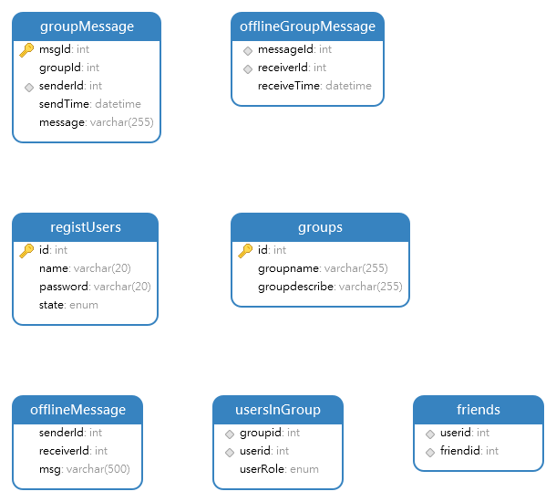

# ServerClientChat
本项目由 `CMake` 构建管理，采用C++17标准，依赖 `Muduo` 网络库、`MySQL++` 数据访问库、`fmt` 格式化库、`Redis++` 客户端库，运行在Linux环境下的网络聊天服务程序
### 项目主要功能
项目实现一个通讯工具，主要业务分为注册、登录、加好友、离线消息、单聊、创建群、加入群、群聊。服务器和客户端之间采用JSON作为内部通信传输协议。主要的消息类型如下
```cpp
enum class ENUM_MSGTYPE
{
	REGISTOR,
	REGISTOR_ACK,

	LOGIN,
	LOGIN_ACK,

	ADDFRIEND,
	ADDFRIEND_ACK,

	DELFRIEND,
	DELFRIEND_ACK,

	GETFRIENDLIST,
	GETFRIENDLIST_ACK,

	JOIN_GROUP,
	JOIN_GROUP_ACK,

	LEAVE_GROUP,
	LEAVE_GROUP_ACK,

	CREATE_GROUP,
	CREATE_GROUP_ACK,

	PEER_CHAT,
	PEER_CHAT_ACK,

	GROUP_CHAT,
	GROUP_CHAT_ACK
};
```
考虑到nlohmann Json无法对用户自定义的类型进行序列化和反序列化，需要自己一并提供以下两个函数供Json库调用
```cpp
void from_json(const nlohmann::json& j, ENUM_MSGTYPE& e);
void to_json(nlohmann::json& j, const ENUM_MSGTYPE& e);
```
### 服务器端的环境依赖

#### **C++ 第三方库依赖：**

| 依赖库                        | 功能描述                                          |
| -------------------------- | --------------------------------------------- |
| `mysqlpp`                  | MySQL++ 库，C++ 封装的 MySQL 客户端库，用于数据库访问          |
| `muduo_base` + `muduo_net` | 高性能 C++ 网络库，适用于多线程 TCP 网络编程                   |
| `fmt`                      | 格式化输出库，C++20 中被采纳为 `std::format` |
| `hiredis`                  | 官方 Redis C 客户端库，用于和 Redis 通信                  |
| `redis++`                  | Redis C++ 客户端库，封装在 hiredis 上，提供更现代 C++ 接口     |
|`nlohammn Json`|JSON序列化和反序列化库，最好用的Json库|
|`magic_enum`|一个轻量级的 C++17/C++20 库，它提供了 枚举类型的反射能力，无需编译，头文件only|

---

#### **项目运行环境配置**

| 路径                              | 含义或来源                         |
| ------------------------------- | ----------------------------- |
| `${PROJECT_SOURCE_DIR}/include` | 项目自定义头文件                      |
| `/usr/include/mysql++`          | 安装的 MySQL++ 库头文件            |
| `/usr/include/mysql`            | MySQL 客户端基础头文件（libmysql）      |
| `/home/g/muduo/`                | Ubuntu上只能通过源码编译Muduo库 |

---

####  **库文件路径：**

```cmake
target_link_directories(server PRIVATE /home/g/build/release-cpp11/lib)
```

muduo 在该路径下进行编译并链接

---


### 客户端的环境依赖
由于已提取公共的数据类型与方法定义，因此项目依赖和服务端相同，具体可参考Client端的CMakeLists.txt

### MySQL数据库表结构
本项目中用到的MySQL数据库表如下图所示



## **tips：**

* 编译目标输出路径为 `${PROJECT_SOURCE_DIR}/bin`
* Debug 模式下会生成 `*_d` 可执行文件（CMakeLists.txt中加了 DEBUG\_POSTFIX）